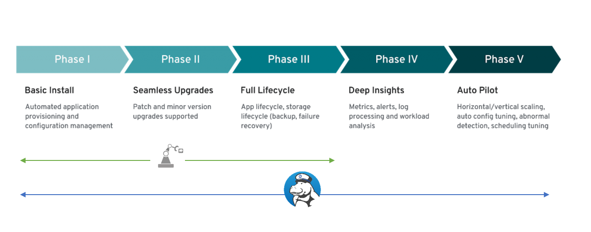
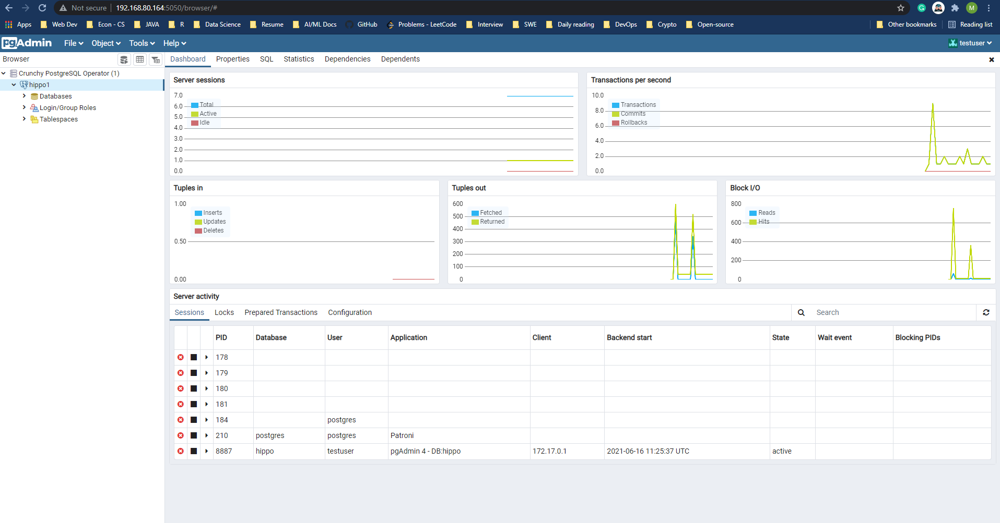

# SEMINAR ON `PostgreSQL Operator`

## **Author:** *Julian (Phong) Ng.* 

**Date of issue**: *June 22th 2021*

---
## TABLE OF CONTENTS

## [Section 1: Overview on PostgreSQL Operator](#Section-1:-Overview-on-PostgreSQL-Operator)
  
- ### [What is `Operator` in Kubernestes? Mission/Goal of `Operator`](#What-is-`Operator`-in-Kubernestes?-Mission/Goal-of-`Operator`)

- ### [What is `PostgreSQL`?](#What-is-`PostgreSQL`?)
  
- ### [Why `PostgreqSQL Operator`?](#Why-`PostgreqSQL-Operator`?)

- ### [Specific Use Cases](#Specific-Use-Cases)

- ### [How to work with `Operator`?](#How-to-work-with-`Operator`?)

- ### [Available Options](#Available-Options?)
  
## [Section 2: Available Solutions Into Action](#Section-2:-Available-Solutions-into-action)

- ### [Community Support / Popularity](#Community-Support-/-Popularity)

- ### [Documentation](#Documentation)
  
- ### [How to `Install` & `Deploy`?](#How-to-`Install`-&-`Deploy`?)

- ### [Architecture & Design](#-Architecture-&-Design)

- ### [Capability Level](#Capability-Level)
  
- ### [Offered Features](#Offered-Features)

## [Section 3: Demo features](#Section-3:-Demo-features)

## [References](#REFERENCES)

---
# Section 1: Overview on PostgreSQL Operator 

## What is `Operator` in `Kubernestes`? Mission/Goal of `Operator`

> Before moving forward, we better revise some basics about `Kubernetes` to understand the underlaying ideas behind `Operator` - the `Protagonist` of today's show.

### Kubernetes


#### **Definition**

`Kubernetes`, the most widely-adopted Container Orchestration Platform, emerges as an cutting-edge approach in working with containerized applications. The platform builds up with high level of complexity in its ecosystem.

#### **Features**

Offering users with notatble characteristics: 
    - `Open Source`
    - `Modular`
    - `Portable`
    - `Extensible` 

=> Usage of `Kubernetes` leverages **simplicity**, **automation** during application deployment. 

#### Sample Scenerio: `Managing an application on K8S`

> Review a case study in the deployment of a random application to `Kubernetes`. The following operations may involve during the operations of such application.

**Actions**:

- Deploying an application on demand
- Taking and restoring backups of that application's state
- Handling upgrades of the application code alongside related changes such as database schemas or extra configuration settings
- Publishing a `Service` to applications that don't support Kubernetes APIs to discover them
- Simulating failure in all or part of your cluster to test its resilience
- Choosing a leader for a distributed application without an internal member election process

#### **Shortcomings?**

From above example, we can draw a quick conclusion: the built-in capabilities of `Kubernetes` are not **sufficient** & **determinated** in many scenarios (for example, a lot of handy works still need to be done when working with specific applications). This shortcomming highlights a key feature of `k8s` - **extensibility**. 

### Kubernetes Operator


#### **Definition**

```sh
   Operators are software extensions to Kubernetes that make use of custom resources to manage applications and their components. Operators follow Kubernetes principles, notably the control loop.
```

`Kubernetes Operator` is a significant implementation of this concept. An `Operator` is a program that encapsulated with another layer of abstraction for a particular application to deploy on `k8s`cluster. It encompasses the **domain-specific logic** for deploying & operating the target Kubernestes Application while observing a reduction of workload as well as complexity for human administrator. 

Now, by utilizing `Operator`, human knowledge on application has been embedded as code.  

#### **Articles To Read**

[Kubernetes Operator Pattern](https://iximiuz.com/en/posts/kubernetes-operator-pattern/)

[Operator Patern - Kubernetes Official Doc](https://kubernetes.io/docs/concepts/extend-kubernetes/operator/)

## What is `PostgreSQL`? [[4]]() [[5]]()


#### **Definition** 

- PostgreSQL is an advanced, enterprise-class, and open-source object-relational database system.
- Pronounces PostgreSQL as `/ˈpoʊstɡrɛs ˌkjuː ˈɛl/`.
- **History**: started in 1986 at Berkeley Computer Science Department, University of California.

#### **Features**

- Supports both SQL (relational) and JSON (non-relational) querying.
- Compatible with multiple programming language.
- Extensisble - allow user self-defined data type, index types,...
- Suits complex system/platform where advanced queries are required.
- Achieves very high levels of concurrency - mulitple users can access.

#### **Usages**

- Primary database for many **web applications** as well as **mobile** and **analytics applications**. 
- Especially in systems requiring execution of complex queries. Suit for **Data Warehousing** and **Data analysis** applications that require fast read/write speeds.


## Why `PostgreqSQL Operator`?


 


```
 Main purpose of the PostgreSQL Operator is to create and update information around the structure of a PostgreSQL Cluster, and to relay information about the overall status and health of a PostgreSQL cluster
```

**Circumstance**
`PostgreSQL` is a object-relational database management platform. The major focus of it revolves around `data` - the essential non-physical entity
of systems. 2 key characteristics of `database` can be itemized as following:
	- A database for most applications is not `static`. It always subjects to mutability during performance. 
	- Database requires dynamic interactions with `storage disk`.

Given its nature, `PostgreSQL` falls under the category of `Stateful` on `Kubernetes`. Once said, `sateless is easy, stateful is hard`. In the case of `stateful` applications, we are manipulating & managing the `storage` & `application` simultaneously. Multiple configurations & actions entail in the process. Furthermore, being knowledgeable with `PosgreSQL` & `Kubernetes` is a **must** for human-operator, which builds up another layer of grueling prerequisites. 

**The need of `PostgreSQL Operator`**

1. **Automation**: 
`PostgreSQL Operator` proposes a solution that can be bring the balance back toward a more workable fashion in administrating & building `PostgreSQL` on `Kubernetes`. The integration of specific logic on `PosgreSQL` into `Kubernetes` diminishes the knowledge-related precondition for administrator. At this point, **automation** is the key value of `Operator`. With it, everything are carried out in a *scallable*, *repeatable* manner.

2. **Reusability**: 
`Operators` offer `templates` for various tasks. As compared to `templates`, they are hightly well-defined in accordance with a standardized format in order to adapt and re-automate a set of processes at demand.  

3. **Cloud Native**: 
As the rise of `Cloud Native` application, employing `Operator` in `Kubernetes` is a way of promoting such advanced transformation. 

## Specific Use Cases

**Comprehensive & dedicated solution in managing/launching `PostgreSQL` in `Kubernetes`**

- Using `Operator` enhances `automation` capability & speed up the whole process.

**Perform `PostgreSQL`-domain Logic & Configurations**

- Provided with dedicated `Kubernetes Object` built only for `PostgreSQL` to handling all operations: *provisioning, terminating, scaling, etc*

- Further *customizations* can be done on `Operator`'s object to meet specific requirements.

**High-Availability & Resiliency**

- Designed with capabilities to deal with *points of failure*, including but not limited to features like `backups`, `Pod Anti-Affinity`,...)

**Transform the Application into `Cloud & Kubernetes Native`**

- The more tasks automated by `Kubernetes`, the more `Cloud Native` the application becomes.

## How `Operator` works?

### Levels of Capacity [[2]]()

*5 phases included*.

> Each Phase corresponds to a specific set of features on workload. The details are specified as below.


#### **PHASE I**: *Basic Install*  

 - `Automated application provisioning and configuration management`
 - Application can be provisioned via a `CR` - Custom Resource. All installation configs can be specified in this file
 - User should not create/manage config files outside `K8S`

    **E.g**: Deploying a Database by creating `Deployment`, `Service`, `ConfigMap`, `PVC`, various `workload`s etc via a 

#### **PHASE II**: *Seamless Upgrades*

- Upgrade is as simple as possible for user, inlcuding upgrading both `Operator` & `Operand`
- Upgrade of the managed workload:
	- *Operand can be upgraded in the process of upgrading the Operator, or Operand can be upgraded as part of changing the CR*
	- *Operator understands how to upgrade older versions of the Operand, managed previously by an older version of the Operator*
	- *Upgrade of the Operator*
	- *Operator can be upgraded seamlessly and can either still manage older versions of the Operand or update them*
	- Operator conveys inability to manage an unsupported version of the Operand in the status section of the CR

#### **PHASE III**: *Full lifecycle*

- Able to perform `backup` + `restore` without further/deep intervention into the application.
- Extends to multiple functionality:
    - liveness & readiness probes
    - Multiple replicas
    - Rolling updates strats
    - CPU + mem requests & limits
...

#### **PHASE IV**: *Deep Insights*

Set up full monitoring & alerting. Rules/Policies for monitoring/alerting agents are initiated as soon as operand CR is created

- **Monitoring**
	- Operator exposing metrics about its health
	- Operator exposes health and performance metrics about the Operand

- **Alerting and Events**
	- Operand sends useful alerts
	- Custom Resources emit custom events

- **Metering**
	- Operator leverages Operator Metering

#### **PHASE V**: *Auto Pilot*

 - *Highest level*. Aims to eliminate remaining manual actions
 - The Operator should understand the application-level performance indicators and determine when it’s healthy and performing well.
 - Able to tune `Operand` performance: scheduling another node the pods are running/changing config of `Operand`:
	- **Auto-scaling**
		- Operator scales the Operand up under increased load based on Operand metric
		- Operator scales the Operand down below a certain load based on Operand metric

	- **Auto-Healing**
		- Operator can automatically heal unhealthy Operands based on Operand metrics/alerts/logs
		- Operator can prevent the Operand from transitioning into an unhealthy state based on Operand metrics
	
	- **Auto-tuning**
		- Operator is able to automatically tune the Operand to a certain workload pattern
		- Operator dynamically shifts workloads onto best suited nodes
	
	- **Abnormality detection** 
		- Operator determines deviations from a standard performance profile

 **Example**: `A database operator monitors the query load of the database and automatically scales additional read-only slave replicas up and down.`

### **Operator Categories**

 There are 3 available `Operator` types corresponding to each supported developing options. Each type posseses different capabilities. 

 #### **Go**: *level 5*


- **Cons**: Considered to be the most `challenging` option.
- **Pros**: 
	- Native to `K8S` runtime environment
	- Rich libs for specific to `Operator`
    - Currently the most-used according to [OperatorHub](https://operatorhub.io/)

#### **Ansible**: *level 5*


#### **Helm**: *level 2*


### `Operator` Patterns

```
Operators are software extensions to Kubernetes that make use of Custom Resources to manage applications and their components. Operators follow Kubernetes principles, notably the Control Loop
```

#### **Building Block**: `Custom Resource`

- `Operator` implements `Custom Resource`[[3]]()
    - an **extension** of the Kubernetes API that is not necessarily available in a default **Kubernetes** installation. 
    - Represents a customization of a particular **Kubernetes** installation.

- **Custom Kubernetes controller** that uses **Custom Resources** (CR) to manage applications and their components.
	- Operator translates the high-level directives into the low-level actions  

## Available Options

> There are 2 choices for your team to make decisions here. Based on specific needs, it can be either `creating your own Operator` or `Integrating an existing solution`. 

### Build your own `Operator`

#### **Available tools/framework**

> **Note**: there are multiple frameworks for creating your personal `Operator`. But I would focus only on `Operator SDK` in this documentation. 

- [**Operator SDK**](https://sdk.operatorframework.io/) is currently the dominating toolkit to create `native K8S Operators`.


- Other options:
    - [Kubebuilder](https://book.kubebuilder.io/)
	- [KUDO](https://kudo.dev/)
	...

#### **Why `Operator SDK`**?

Facilitates the process of building your own solution by offering:
- High level APIs & abstractions to write
- Code boilerplate to initialize new project with speed
- Covering common `Operator` use cases with extensions

### Integrate available solutions

- Check on [Operator Hub](https://operatorhub.io/) - The Registry for qualified `Kubernetes Operator`.


--- 
# Section 2: Available Solutions Into Action

**Getting started** 
In this Seminar, `Crunchy PostgreSQL Operator` & `Zalando PostgreSQL Operator` have been selected for in-depth consideration.


 

Each `Operator` would be asserted based on following criterias:

1. **Communinity Support/Popularity**
2. **Documentation**
3. **Architecture & Design**
4. **Capability Level**
5. **Installtation & Deployment**
6. **Operate & Administrative `Operator`**
7. **Offered Features** 

## Community Support / Popularity

| Criteria |  |     |
| ----------- | ----------- | ----------- |
| **GitHub Stars** | ~1.7k  | ~1.8k  |
| **Open Issues** | 81 | 264 |
| **Origin Company** | A tech company focuses on deploying `enterprise-grade` PostgreSQL <br> | `Zalando` - a European e-commere focusing on fashion & lifestyle products <br> |
| **Usage** | IBM, SAS,... | Zalando,...  |

## Documentation

| Criteria |  |   |
| ----------- | ----------- | ----------- |
| **Format** | Github markdown<br>Website<br>  |  Github markdown<br>Website<br>   |
| **URL** | [GitHub](https://github.com/CrunchyData/postgres-operator/tree/master/docs)<br>[Web](https://access.crunchydata.com/documentation/postgres-operator/latest/) | [GitHub](https://github.com/CrunchyData/postgres-operator/tree/master/docs)<br>[Web](https://postgres-operator.readthedocs.io/en/latest/) |
| **Review** | User friendly doc<br>Enhanced UI/UX<br>Clear Navigation Structuring<br>Detailed descriptions on topics | User friendly web-based doc<br>Should have better layouts structuring<br> |

## How to `Install` & `Deploy`?

|  |    |
| ----------- | ----------- |
| **- Advanced** & **Mostly Automated** installer<br>- Have `default storage class` set up - *most advanced Kubernetes environments*<br>- Use a deploying container (`pgo-container`) -> perform **setup** & **installation** tasks  | - Via `kubectl`: *with some options*: <br>*+ `Manually deploy each maniest`*<br>*+ `Helm chart`* <br>*+ `Kustomization`* |

## Architecture & Design

| Criteria |  |    |
| ----------- | ----------- | ----------- |
| **Deployment Design** |  |    |
| **Deployment Components** | This `Operator` can be compared as a `mini` **Control Plane**, which built with 4 components: <br>- `operator`: center of this `Operator`. Contains `controllers` <br>- `api-server`: exposes point of communication<br>- `scheduler`<br>- `event`<br> | A single `Operator`  |
| **Offered CRD(s)** | 4 CRDs available.  <br> - `pgclusters.crunchydata.com`: Stores information required to manage a PostgreSQL cluster. <br>- `pgreplicas.crunchydata.com`: Stores information required to manage the replicas within a PostgreSQL cluster. <br>- `pgtasks.crunchydata.com`: A CRD accepting a type of task that is needed to run against a cluster (e.g. take a backup) and tracks the state of that task through workflow. <br>- `pgpolicies.crunchydata.com`: Stores a reference to a SQL file that can be executed against a PostgreSQL cluster. | Only 1 CRD available.<br>- `posgresqlCRD`: contains required info to launch/administrate a PostgreSQL Cluster. |

**Comparing Design of 2 Operators**

> Closer look on design of each Operator with below diagram [[7]]()


## Capability Level

Revising 5 levels of `Capability` for Operator:
1. `Basic Install`
2. `Seamless Upgrades`
3. `Full Lifecycle`
4. `Deep Insights`: *Monitoring - Metrics collection, log processing*
5. `Auto Pilot`: *Horizontal/Vertical scaling, auto config, tracking abnormalities,...*

| Criteria |  |     |
| ----------- | ----------- | ----------- |
| **Level** | **5** | **3** |
| **Overview** | `CrunchyData` offers **monitoring/alerting stacks** & **auto-healing** in its solution. |  `Delivers an easy to run highly-available PostgreSQL clusters on Kubernetes` |



## Operate & Administrative “Operator”

| Criteria |  |     |
| ----------- | ----------- | ----------- |
| **CLI** | External CLI is available: `pgo` <br> | Mostly still use K8S's CLI to manage via `manifests`: `kubetctl`  |
| **Connecting to `PostgreSQL` Cluster** | Support usage of `pgBouncer` - **PostgreSQL connection pooler**. <br>   |  Support usage of `pgBouncer` - **PostgreSQL connection pooler**. <br>  |
| **Dashboard** | Web-based Dashboard  | Built-in Web UI |

## Offered Features

> Features of each Operator would be taken into account sequentially


### **Perform administrative operations of `PostgreSQL Cluster` via CLI `pgo`**

- As this Operator has its own `api-server` -> a CLI of its own available:  `pgo`
- Sample actions:
    - Adding `PostgreSQL` cluster:

        ```sh
        $ pgo create cluster -n pgo test-cluster
        ```

    - Manage `user` (s)

    - Connecting a PostgreSQL cluster
- Visit `Crunchy PostgreSQL Operator Documentation` for details on: [**using `pgo` Client**](https://access.crunchydata.com/documentation/postgres-operator/4.7.0/pgo-client/) 


### **PostgreSQL Cluster Provisioning**: allow customization of `Pods` & `PostgreSQL`

- **Create & Delete**:
	- Can create new Cluster using `Backup` of anther Cluster
	- When deleting a `PostgreSQL` cluster, allow following options:
		- `keep backups`
		- `keep data`

- **(Horizontal) Scaling**: via `pgo`. Sample commands:
    ```bash
    $ pgo scale <>
    ```

### **Rollback& Updates** [[8]]()

#### **Confronting Issue**

- `PostgreSQL` is a **stateful application**, which adds another layer of complexity as data constantly being modified/updated overtime.

- The `PostgreSQL Operator` provides a mechanism for rolling updates implicitly on certain operations that change the Deployment templates and explicitly through the `pgo` restart command.

#### **Workflow**

> Implements following workflow to minimize the amount of downtime when the primary is taken offline for a restart.

**Step 1**: Each `replica` is updated in sequential order. This follows the following process:

- The `replica` is explicitly shut down to ensure any outstanding changes are flushed to disk.
- If requested, the PostgreSQL Operator will apply any changes to the Deployment.
- The `replica` is brought back online. The PostgreSQL Operator waits for the `replica` to become available before it proceeds to the next `replica`.

**Step 2**: Above steps are repeated until all of the `replicas` are restarted.

**Step 3**: A controlled switchover is performed. The PostgreSQL Operator determines the best `replica` to become the new primary while demoting the `primary` to become `replica`.

**Step 4:** The **workflow** repeats from **Step 1**.

### **High Customizability of PostgreSQL Cluster**: can modify/define your `PostGreSQL` at your choice 
- Some customization available:
	- Choose different `storage classes`:
        - `posix` - built-in `K8S`
        - `S3`
        ...
	- HA rules
	- Sidecars + additional service options

### **Disaster Recovery**: Backup & Restore

#### **WAL**: Write Ahead Logging [[9]]() [[10]]()

**Definition**: 
*PostgreSQL writes all modifications as history data into a persistent storage, to prepare for failures --> `WAL segment file`. In PostgreSQL, the history data are known as XLOG record(s) or WAL data.*

**Basic Workflow**:
	- *XLOG records are written into the in-memory `WAL buffer` by change operations such as insertion, deletion, or commit action*.
	- *They are immediately written into a `WAL segment file` on the storage when a transaction commits/aborts*


#### `pgBackRest` [[11]]():

**Overview**

- A `pgBackRest repo` is created in during the same creation of `PostgreSQL cluster`.
	- `repository` is where pgBackRest stores backup and archives WAL segments
- open source backup - restore utility --> capatilble with heavy databases
- Improvements vs `pg_basebackup` tool.

**Deployment Components**: 
- A Deployment
- A Secret containing information specific to the PostgreSQL cluster deployed with (e.g. SSH keys, AWS S3 keys, etc.)
- A Service

**Usage**:

- Can use to perform a db copy for `Streaming App` with existing backup
- Rubuild old standby server 

**Supported Features**:

- Parallel Backup & Restore
- Local or Remote Operation
- Full, Incremental and Differential Backups
- Backup Rotation and Archive Expiration
- Backup Integrity check
- Backup Resume
- Delta Restore
- Encryption


**Restores**: [[12]]()

Allow to perform
- `full-restore`  
- `Point-in-time recovery`: Revert to a specific backup at specified time.

Type of Restore:

- **Restore to a New Cluster/Cloning**:
    - Creating a copy of a PostgreSQL cluster that can be used for other purposes. Another way of putting this is `creating a clone.”
    - Restore to a point-in-time and inspect the state of the data without affecting the current cluster 

- **Restore in-place**
    - a recovery on your existing data directory
    - **Cautious & consider carefully** 

**Backups**: 

- Support **local** & **offsite** backups
    - `local`: PVC - local storage on `Kubernetes`
    - `S3`, `gcs`, etc: storage from external Providers.


- can schedule to occur at specific time.
    - **E.g**: *Daily backup schedule at 1a.m*. 

- 3 backup strategies: `full`, `differential`, `incremental`
    - **Full**: Back up the entire database
    - **Differential**: Create a backup of everything since the last full back up was taken
    - **Incremental**: Back up everything since the last backup was taken, whether it was full, differential, or incremental

**Recommended sources**:
 - [Write Ahead Logging](https://www.interdb.jp/pg/pgsql09.html)

### **Cloning**:

- Creating clusters from operating clusters / backups

### **High Availability**

- Ensure HA even when `PostGreSQL Operator` is not available. 
- PostgreSQL ensures HA by themselves -> no `single point of failure`.

**Mechanism**: ensures the `fault-tolerant` capability of Cluster

> Implements the **[Raft Asslgorithm](https://raft.github.io/)** - `consensus algorithm` [[13]]()

- Each PostgreSQL cluster have multiple nodes. 1 node is `Leader/Primary`, others are `followers/replicas`.
- `Primary` replicates changes to all `followers` ---> `synchronous replication`.
- `Transaction`: not considered to be complete until all changes have been sent to `followers`.
- If `Primary` down -> no updating the `lock` in allowable failover time. ==> `Election` takes place to bring up new `Primary`

**Auto healing**: failed node recovers/restores itself & follow new primary node. ---> `Auto-pilot`
**Pod Anti-Affinity**: schedule & deploy Pods in different Nodes -> **Resiliency**

### **Affinity & Toleration**:

**Node Affinity**: scheduling deployments of Pods to `specific` Nodes

**Pod Anti-Affinity**: schedule & deploy Pods in different Nodes

**Tolerations**: adding rules to schedule Pods to `appropriate` Nodes

### **Dashboard GUI**: `pgAdmin 4`

- User friendly, interactive GUI
- Can enable on cluster as a service
- Functionalities:
	- *manage PostgreSQl cluster*
	- *query a db from browser*



### **Monitoring**

Built-in components: 
- `pgMonitor`: includes monitoring solutions `Prometheus`. `Grafana`, `AlertManager`. `postgres_exporter`


- `pgnodemx`

Some monitored parameters:
- Backup status
- Active connections (from users)
- Pod metrics
....

 

## **PostgreSQL Cluster Provisioning**

- Configuration tasks done only via `manifests`
- Create & Updates

- Scaling (Horizontally)

## **Rolling updates**

- The operator also watches updates to its own configuration and alters running Postgres clusters if necessary. 
- For instance, if the Docker image in a pod is changed, the operator carries out the rolling update, which means it re-spawns pods of each managed StatefulSet one-by-one with the new Docker image.

## **Taints & Tolerations**: 

To ensure Postgres pods are running on nodes without any other application pods.

## **Pod Anti Affinity**: 
*Ensure pods running in multiple topologies*

## **Disaster Recovery**: 

- Implements **`Continuous Archiving`**

- Implemented solutions: 
	- `basebackup`: built-in
		- `pg_basebackup` is used to take base backups of a running PostgreSQL database cluster
		- makes a binary copy of the database cluster files, while making sure the system is put in and out of backup mode automatically. Backups are always taken of the entire database cluster; it is not possible to back up individual databases or database objects.
		-  base backup from not only the master but also the standby

	- `WAL-E`: *perform continuous archiving of PostgreSQL WAL files and base backup*
		- OpenSource PostgreSQL database backup tool for efficiently sending PostgreSQL’s WAL (Write Ahead Log) to the cloud.
		- Originally developed by `Heroku`

- Logical backup


## **Cloning** [[12]]()

*Spin up a new cluster as a clone of the existing on*

*2 options here:*
- **Clone from a Storage** (e.g: S3) : 
    - No impact on your production database. 
	- New Postgres cluster is created by restoring the data of another source cluster.
- **Clone directly from a source cluster**:
 	- Fresh copy of your source DB cluster is via pg_basebackup.
	- Increase load on existing cluster


## **High Availability** [[14]]() [[15]]()

- Deploying `PostgreSQL` cluster using `Spilo` 
	- `Spilo` = `PostgreSQL` + `Patroni`

**HA mechanism**:

- Implements the based feature of  `PostgreSQL`: `warm standby`/`log shipping`
- [**Patroni**](https://patroni.readthedocs.io/en/latest/): 
    - Template for HA PostgreSQL 
    - **Asynchronous Replication** (*Default*) 
        - cluster is allowed to lose some committed transactions to ensure availability
        - When the primary server fails or becomes unavailable for any other reason Patroni will automatically promote a sufficiently healthy standby to primary
    - **Synchronous Replication** 
        - ensures consistency across a cluster by confirming that writes are written to a secondary before returning to the connecting client with a success
        - does not guarantee zero lost transactions under all circumstances.

## **Dashboard GUI**

Manage PostgreSQL Cluster only. Operations on databases (e.g: `Query`, `Insert`, etc) not supported  


# Section 3: Demo Features

TO-DO

# References

[[1] Operator Patern - Kubernetes Official Doc](https://kubernetes.io/docs/concepts/extend-kubernetes/operator/)

[[2] Operator Capability Levels](https://sdk.operatorframework.io/docs/advanced-topics/operator-capabilities/operator-capabilities/)

[[3] Custom Resources - Official Kubernetes Documentation](https://kubernetes.io/docs/concepts/extend-kubernetes/api-extension/custom-resources/)

[[4] PostgreSQL Official Documentation](https://www.postgresql.org/)

[[5] What is PostgreSQL?](https://www.postgresqltutorial.com/what-is-postgresql/)

[[6] Overview Architecture Crunchy PostgreSQL Operator](https://access.crunchydata.com/documentation/postgres-operator/4.7.0/architecture/overview/)

[[7] Running Postgres-as-a-Service In Kubernetes - `Crunchy PostgreSQL Operator` vs `Zalando PostgreSQL Operator`](https://ossna2020.sched.com/event/c3Sn/running-your-own-postgres-database-as-a-service-on-kubernetes-lukas-fittl-microsoft)

[[8] Crunchy Operator High Availability ](https://access.crunchydata.com/documentation/postgres-operator/4.7.0/architecture/high-availability/)

[[9] PostgreSQL WAL](https://www.postgresql.org/docs/9.1/wal-intro.html)

[[10] Write Ahead Logging](https://www.interdb.jp/pg/pgsql09.html)

[[11] `pgBackrest` Official Documentation](https://pgbackrest.org/)

[[12] Disaster Recovery `Crunchy PostgreSQL Operator`](https://access.crunchydata.com/documentation/postgres-operator/4.7.0/architecture/disaster-recovery/)

[[13] Raft Algorithm](https://raft.github.io/)

[[14] `Spilo` GitHub Repository](https://github.com/zalando/spilo)

[[15] `Patroni` Official Documentation](https://patroni.readthedocs.io/en/latest/)

[[16] High Availability `Crunchy PostgreSQL Operator`](https://access.crunchydata.com/documentation/postgres-operator/4.7.0/architecture/high-availability/)

[[17] ]()